# github参与开源项目

>目的：跨团队开发
>
>团队的每个成员可以在服务器上或者自己开创一个github仓库，团队成员通过fork该仓库，进行下面的操作就可以跨团队开发。

## fork

### 1.fork一下开源项目的仓库


### 2.进入自己的github账户


### 3.复制自己仓库的链接


点击复制


> 复制地址后：
>
> - ​	可以直接打开终端输入git clone 地址 直接克隆到本地
> - ​	另一种就是下面的方法（通过工具打开）

### 4.这里用IDEA（idea首先登录github账户）


### 5.版本控制输入URL


### 6.打开终端,查看仓库链接


这里只能看到自己仓库的链接地址

### 7：添加上游仓库的地址

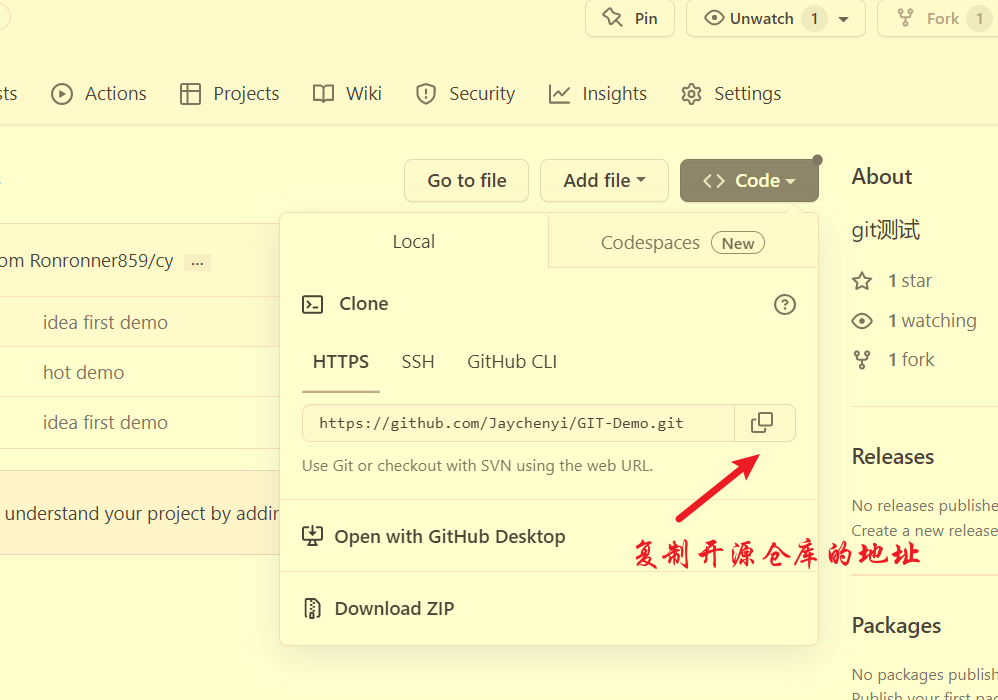

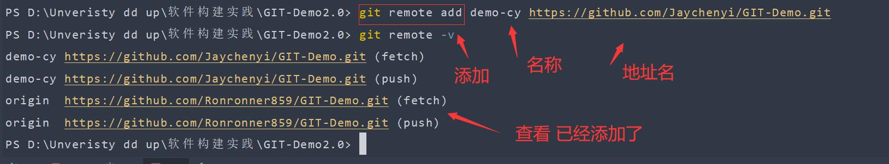

### 8.想给这个项目加一些功能

​	1.首先创建一个分支

```
git branch demo2.0
```

​	2.切换分支，在demo2.0这个分支进行创作不会影响master分支

```
git checkout demo2.0
```

​	3.熟练后可以合并一起写

>git checkout -b demo2.0

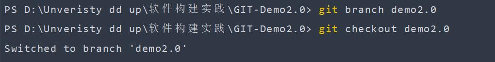

  可以对文件增加一些功能

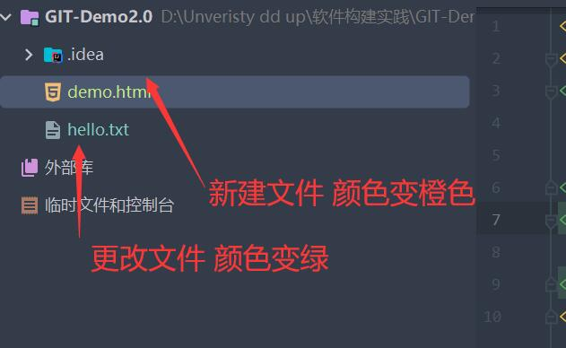

### 9.功能完成后，在该分支在重复一遍基本提交

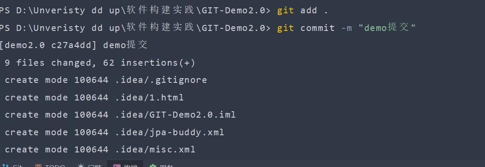

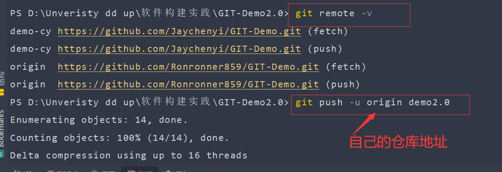

然后就上传成功了

### 10.回到自己仓库

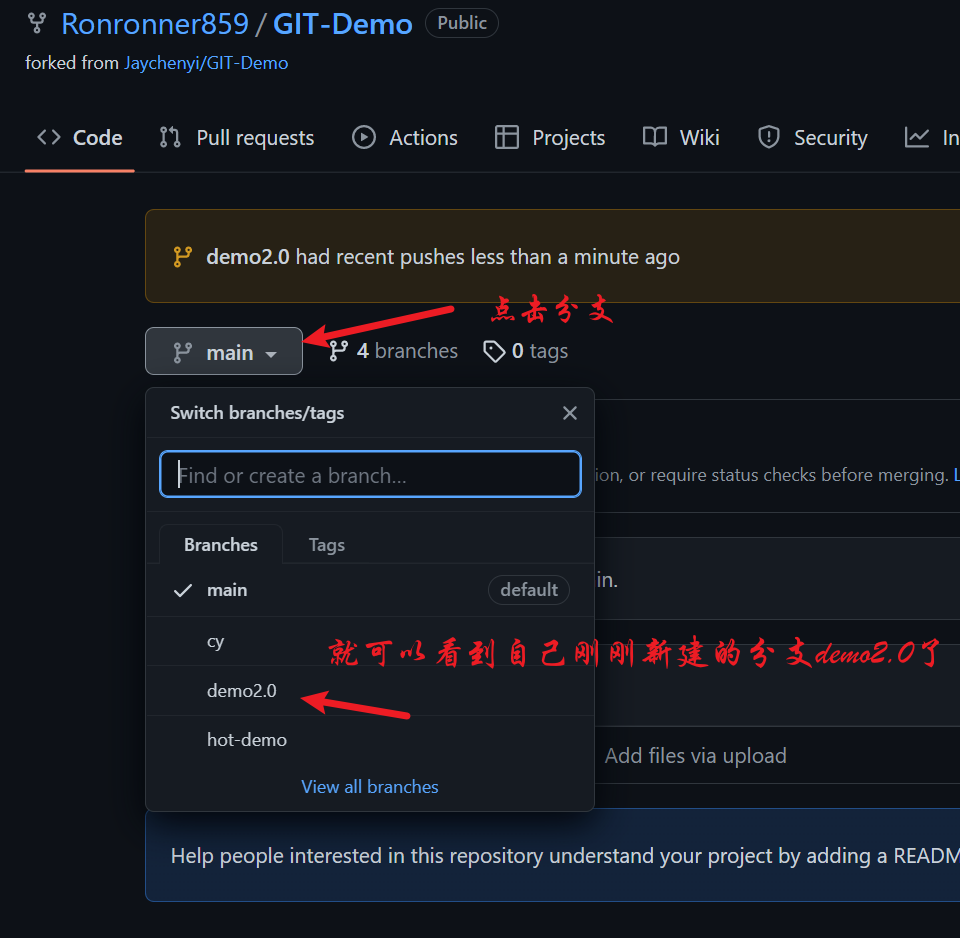

分支下的文件信息

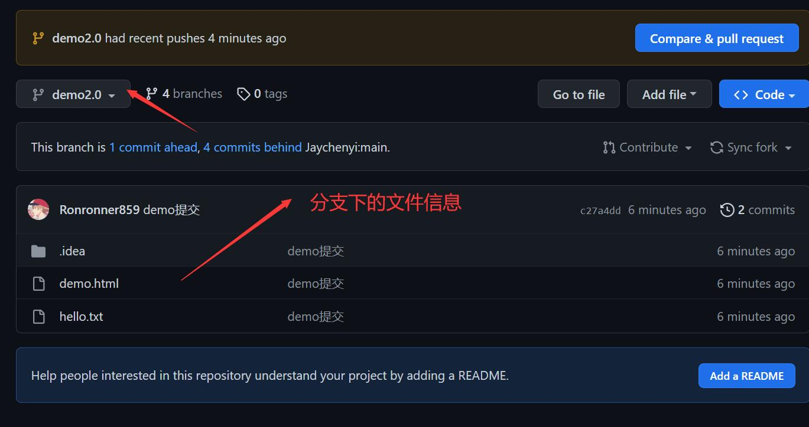

###  11.点击自己仓库的Pull request

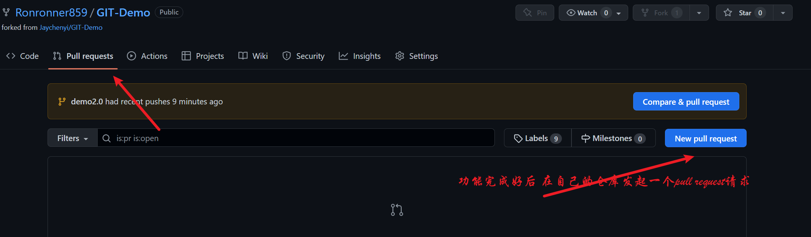

然后新建一个 New pull resquest

### 12.是否要将自己完成的分支发给用户

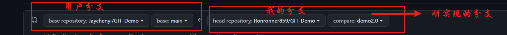

### 13.请求发送后，填写基本功能信息

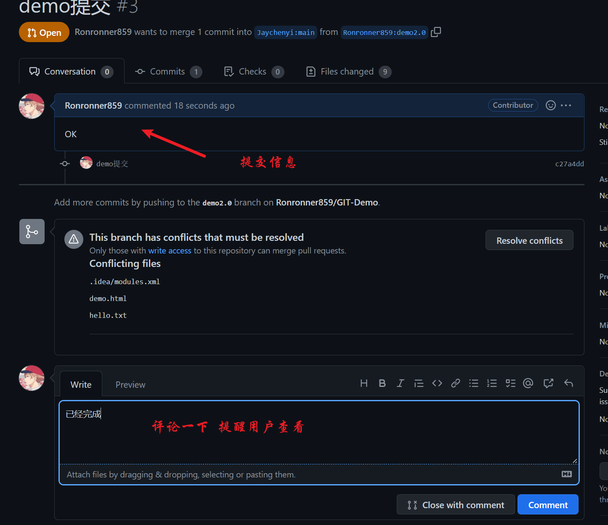

### 14.回到用户的仓库，会受到对方发过来的请求

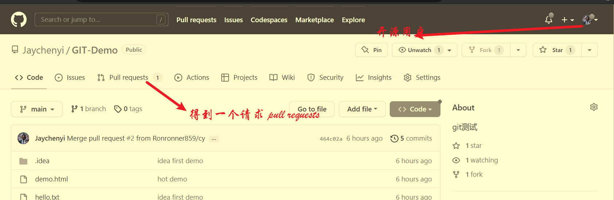

然后看到对方的提交信息

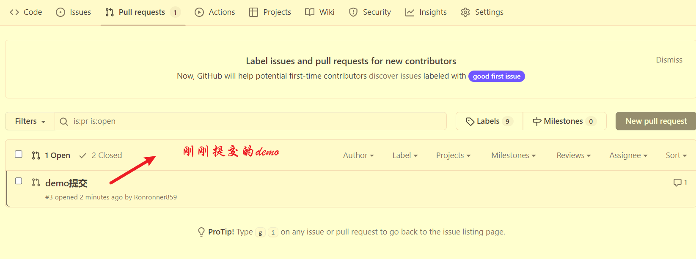

### 15.merge到自己的仓库，将对方的分支合并到自己的仓库

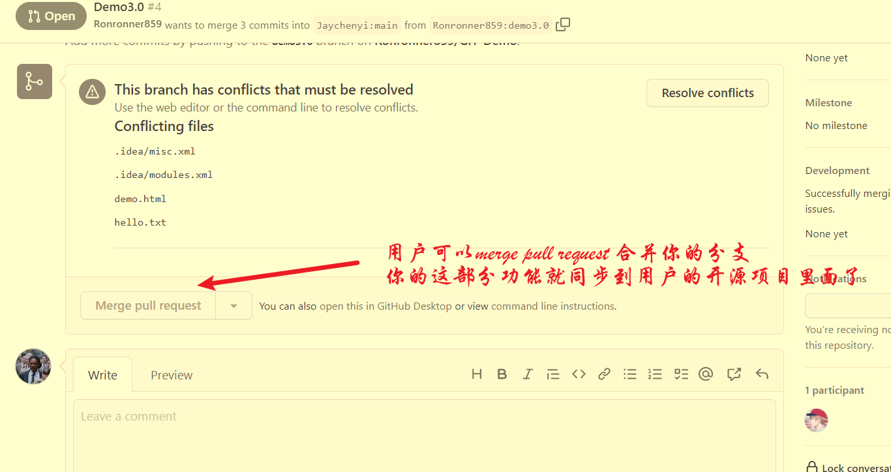

### 16.用户的仓库就更新了对方的实现功能

### 17.中途还会遇到合并冲突等问题..后续更新